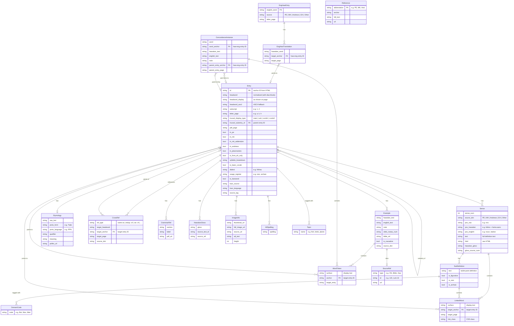

# CHD Database Schema

## Summary

| Table | Rows | Description |
|-------|------|-------------|
| **Entry** | 59,715 | Hawaiian-English dictionary entries (deduplicated + topical-only) |
| **Sense** | ~90K | POS + definition per source dictionary |
| **SubDefinition** | ~30K | Bullet-point sub-definitions within senses |
| **Example** | ~27K | Hawaiian/English sentence pairs |
| **CrossRef** | ~16K | Cross-references between entries |
| **Etymology** | ~2.6K | Proto-Polynesian reconstructions |
| **ImageInfo** | ~200 | Illustrated entry images |
| **EngHawEntry** | 20,712 | English-Hawaiian reverse lookup |
| **EngHawTranslation** | 76,859 | English→Hawaiian word mappings |
| **ConcordanceInstance** | 133,684 | Word-in-context sentence examples |
| **Reference** | 705 | Source abbreviation definitions |

## Enum Types

| Enum | Values |
|------|--------|
| **DictSource** | PE, MK, Andrews, EH, Other |
| **LinkTarget** | internal_entry, concordance, pdf, pollex, grammar, bible_conc, place_name, topical, reference, external, glossrefs, self_link, unknown |
| **CrossRefType** | same as, redup. of, var. of, pas/imp. of, var. spelling of, short for, similar to, plural of, a variety of, cf., see also, see, also |
